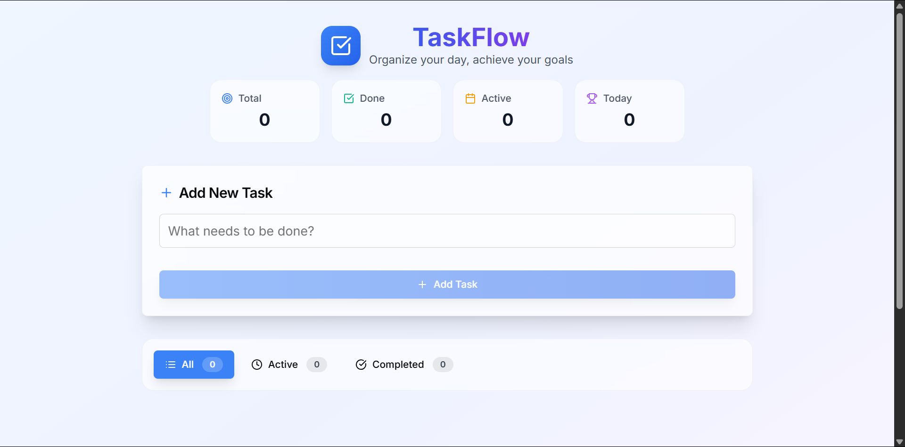

# ✅ TaskFlow

**TaskFlow** is a simple yet powerful to-do list application built with **Next.js**, **Tailwind CSS**, and **TypeScript**. It allows users to organize tasks by **priority**, **category**, and **due date**, and supports tracking completed tasks with the option to clear them when needed.

---

## 🚀 Features

- 📝 Add new tasks with:
  - Title
  - Priority (e.g., High, Medium, Low)
  - Category (e.g., Work, Personal)
  - Due Date
- ✅ Mark tasks as complete
- 🔄 Completed tasks are moved to a **Completed** tab
- 🧹 Clear all completed tasks with a single click
- 🎯 Fully responsive and beautifully styled with Tailwind CSS
- ⚡ Built with performance and developer experience in mind using Next.js + TypeScript

---

## 📸 Screenshots



---

## 🛠️ Tech Stack

| Technology   | Description                     |
|--------------|---------------------------------|
| [Next.js](https://nextjs.org/) | React framework for SSR and routing |
| [Tailwind CSS](https://tailwindcss.com/) | Utility-first CSS for styling |
| [TypeScript](https://www.typescriptlang.org/) | Static typing for JavaScript |
| [React Hooks](https://reactjs.org/docs/hooks-intro.html) | For state management and effects |

---

## 📦 Installation & Setup

```bash
# Clone the repository
git clone https://github.com/your-username/to-do.git
cd taskflow

# Install dependencies
npm install

# Run the development server
npm run dev
````

Then go to [http://localhost:3000](http://localhost:3000) in your browser.

---

## 🧪 Running Lint & Build (for CI/CD)

```bash
# Run ESLint
npm run lint

# Build the application
npm run build
```

---

## 🚀 Deployment

TaskFlow was deployed to platforms like:

* [Vercel](https://vercel.com/) (recommended for Next.js)

---

## 📁 Project Structure (Simplified)

```
to-do/
├── components/       # Reusable UI components
├── pages/            # Next.js pages
├── styles/           # Tailwind & global styles
├── types/            # TypeScript interfaces/types
├── utils/            # Helper functions
└── public/           # Static assets
```

---

## 🙌 Contributing

Pull requests are welcome. For major changes, please open an issue first to discuss what you'd like to change or improve.

---

## 📄 License

This project is licensed under the **MIT License** – see the [LICENSE](LICENSE) file for details.

---

## 🎯 Future Improvements

* Task reminders & notifications
* Drag-and-drop task reordering
* User authentication & saved tasks
* Dark mode toggle

---

## ⭐️ Show Your Support

If you like TaskFlow, give it a ⭐️ on GitHub and share it with friends!

---


